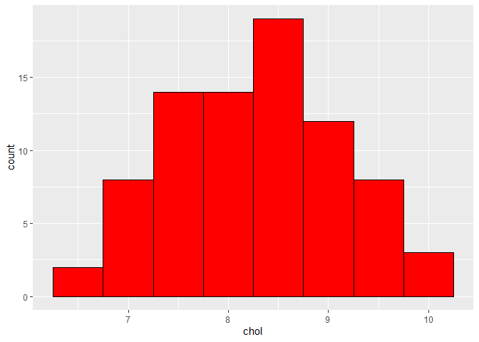
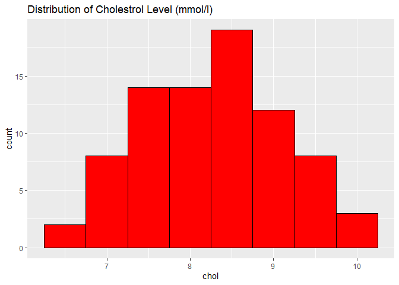
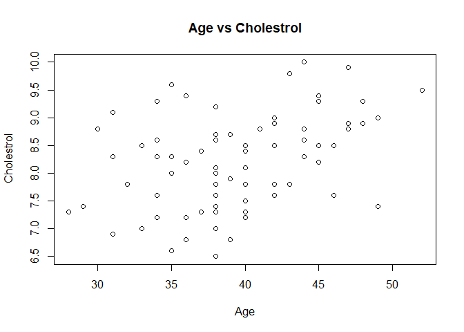
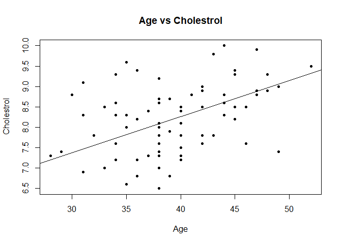
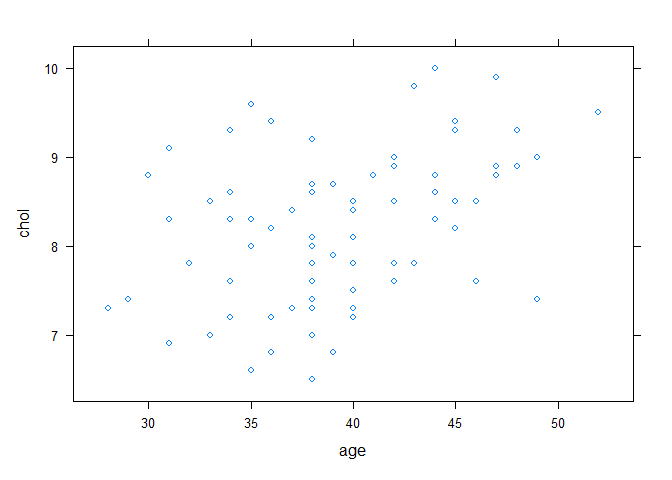
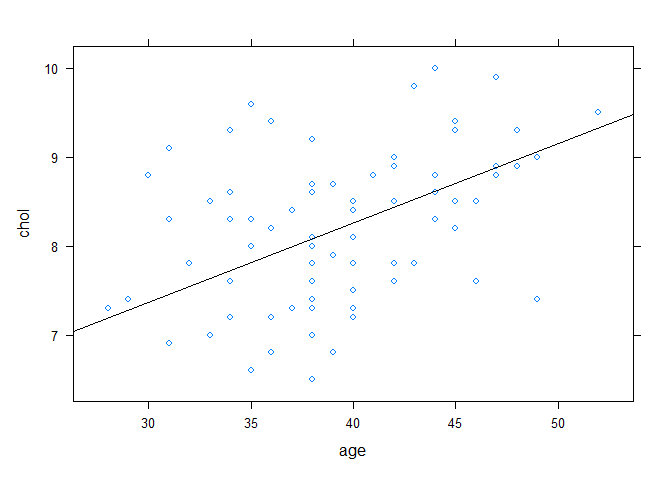
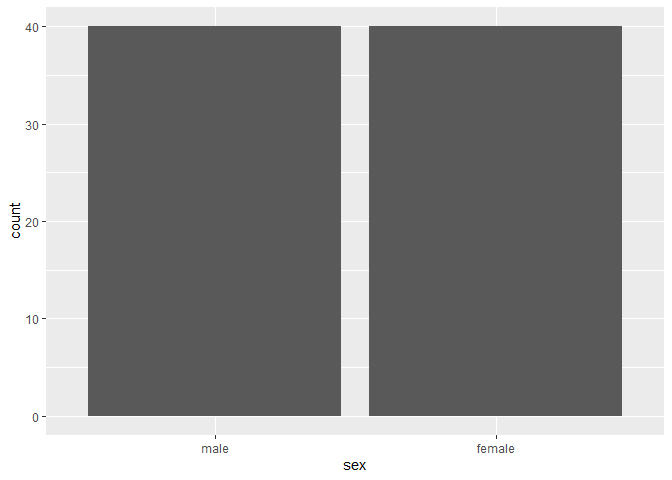
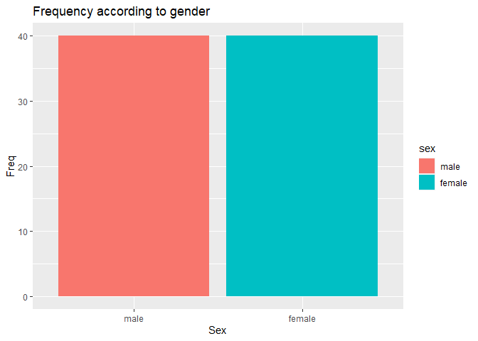
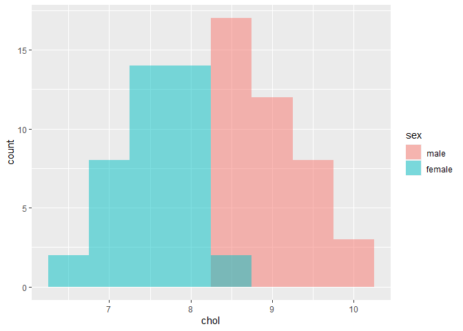
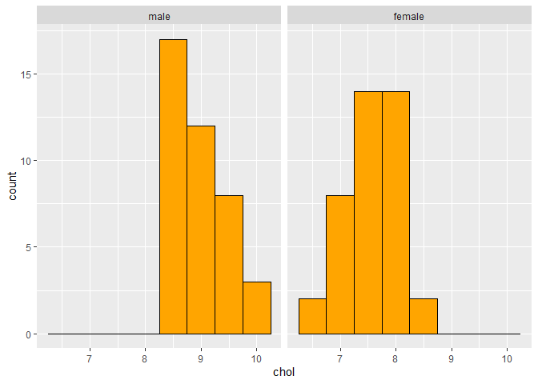

In this training, we will be using data Cholest.xls Easiest way to enter data into R, by ensure the original data being saved in 1 folde rand set it as directory prior to entering the data into R Studio.

# Create the enivronment

## Install or load required package


```r
library("readxl")  ## to read excel file in the directory
library(dplyr) ## Data wrangling
```

```
## Warning: package 'dplyr' was built under R version 4.2.3
```

```
## 
## Attaching package: 'dplyr'
```

```
## The following objects are masked from 'package:stats':
## 
##     filter, lag
```

```
## The following objects are masked from 'package:base':
## 
##     intersect, setdiff, setequal, union
```

## Load the data into environment


```r
Chol <- read_excel("cholest.xls")
```

View the data using several methods

1.  First 6 rows


```r
head(Chol)
```

```
## # A tibble: 6 × 5
##    chol   age exercise   sex categ
##   <dbl> <dbl>    <dbl> <dbl> <dbl>
## 1   6.5    38        6     1     0
## 2   6.6    35        5     1     0
## 3   6.8    39        6     1     0
## 4   6.8    36        5     1     0
## 5   6.9    31        4     1     0
## 6   7      38        4     1     0
```

2.  Structure of the original dataset


```r
str(Chol)
```

```
## tibble [80 × 5] (S3: tbl_df/tbl/data.frame)
##  $ chol    : num [1:80] 6.5 6.6 6.8 6.8 6.9 7 7 7.2 7.2 7.2 ...
##  $ age     : num [1:80] 38 35 39 36 31 38 33 36 40 34 ...
##  $ exercise: num [1:80] 6 5 6 5 4 4 5 5 4 6 ...
##  $ sex     : num [1:80] 1 1 1 1 1 1 1 1 1 1 ...
##  $ categ   : num [1:80] 0 0 0 0 0 0 0 0 0 0 ...
```

3.  We need to concer "sex" into factor/categorical data (we use mutate function)


```r
Chol_1 <- Chol %>% 
  mutate(sex = factor(sex, labels = c("male", "female")),
         categ = factor(categ, labels = c("Grp A", "Grp B", "Grp C")))
```

4.  Again we look at the updated datasets


```r
str(Chol_1)
```

```
## tibble [80 × 5] (S3: tbl_df/tbl/data.frame)
##  $ chol    : num [1:80] 6.5 6.6 6.8 6.8 6.9 7 7 7.2 7.2 7.2 ...
##  $ age     : num [1:80] 38 35 39 36 31 38 33 36 40 34 ...
##  $ exercise: num [1:80] 6 5 6 5 4 4 5 5 4 6 ...
##  $ sex     : Factor w/ 2 levels "male","female": 2 2 2 2 2 2 2 2 2 2 ...
##  $ categ   : Factor w/ 3 levels "Grp A","Grp B",..: 1 1 1 1 1 1 1 1 1 1 ...
```

5.  View certain variable (eg : age), we use \$ to subset the data frame.


```r
Chol_1 $age
```

```
##  [1] 38 35 39 36 31 38 33 36 40 34 38 40 40 28 37 38 49 29 40 38 34 46 42 38 32
## [26] 43 42 40 38 39 39 39 35 38 40 38 45 36 31 34 44 35 40 37 33 46 42 40 45 42
## [51] 45 38 34 44 39 38 39 47 41 44 30 48 47 42 42 49 31 38 38 48 34 45 45 36 45
## [76] 52 35 43 47 44
```

6.  Summary of the data set


```r
summary(Chol_1)
```

```
##       chol            age           exercise         sex       categ   
##  Min.   : 6.50   Min.   :28.00   Min.   :2.000   male  :40   Grp A:25  
##  1st Qu.: 7.60   1st Qu.:36.00   1st Qu.:4.000   female:40   Grp B:33  
##  Median : 8.30   Median :39.00   Median :4.000               Grp C:22  
##  Mean   : 8.23   Mean   :39.48   Mean   :4.225                         
##  3rd Qu.: 8.80   3rd Qu.:43.25   3rd Qu.:5.000                         
##  Max.   :10.00   Max.   :52.00   Max.   :6.000
```

## Descriptive Statistic

Now we will try to do descriptive statistic for some of the variables in the data frame using basic function in R studio.

Numerical variable

1.  mean for variable age


```r
mean(Chol_1$age)
```

```
## [1] 39.475
```

2.  Standard deviation for variable age


```r
sd(Chol_1$age)
```

```
## [1] 5.128661
```

3.  median for variable age


```r
median(Chol_1$ age)
```

```
## [1] 39
```

Categorical variable

1.  Describe categorical variable according to its count (use summarry () or table ())


```r
summary(Chol_1 $ sex)
```

```
##   male female 
##     40     40
```

2.  Proportion of the categorical data


```r
prop.table(table(Chol_1 $ categ)) *100
```

```
## 
## Grp A Grp B Grp C 
## 31.25 41.25 27.50
```

To view and count the percentage together


```r
cbind(n = table(Chol_1$categ),
"%" = prop.table(table (Chol_1 $ categ))*100)
```

```
##        n     %
## Grp A 25 31.25
## Grp B 33 41.25
## Grp C 22 27.50
```

Visual Exploration

Now we will learn how to do basic visual exploration in R studio

Load additional package to plot interactice graph


```r
library(ggplot2)
```

```
## Warning: package 'ggplot2' was built under R version 4.2.3
```

In ggplot2, - Type ggplot (data = X) function to choose dataset - the aes () for variable to be plotted - then, use geom_X tp specify the geometric (X) form of the plot

1.  Plot numerical variable (Basic)


```r
ggplot(Chol_1,aes(x= chol)) + ## Choose the dataset
  geom_histogram(binwidth = 0.5, ## Specify geometric to histogram
                 colour = "black", fill = "red") ##custom the histogram
```

<!-- -->

2.  Add title to the histogram


```r
ggplot(Chol_1,aes(x= chol)) + ## Choose the dataset
  geom_histogram(binwidth = 0.5, ## Specify geometric to histogram
                 colour = "black", fill = "red") + ##custom the histogram
  ggtitle("Distribution of Cholestrol Level (mmol/l)") ## add title
```

<!-- -->

3.  Plotting relationship between numerical variable

4.  Using basic plot function

-   Basic scatter plot


```r
plot(Chol_1$age, Chol_1$chol, main = "Age vs Cholestrol",
     xlab = "Age", ylab = " Cholestrol")
```

<!-- -->

-   add regression line


```r
plot(Chol_1$age, Chol_1$chol, main = "Age vs Cholestrol",
     xlab = "Age", ylab = " Cholestrol", pch = 20)  ## add label and plot character
abline(line(Chol_1$age, Chol_1$chol))  ## add regression line
```

<!-- -->

b)  Use "lattice" package to do scatter plot


```r
library(lattice)
```

-   Scatter plot using xyplot() function


```r
xyplot(chol ~ age, data = Chol_1)
```

<!-- -->

-   Add fit line


```r
xyplot(chol ~ age, data = Chol_1,
       panel = function(x,y) {
         panel.xyplot(x,y)
         panel.abline(line(x,y))
       })
```

<!-- -->

4.  Plot categorical variable (basic)


```r
ggplot(data = Chol_1, aes(sex)) +
geom_bar() ## using bar graph
```

<!-- -->

5.  add labels and titles to the plot


```r
ggplot(data = Chol_1,  aes(sex, fill = sex)) +
geom_bar()  + xlab ('Sex') + ylab ('Freq') + ## add label
  ggtitle('Frequency according to gender') ## add title
```

<!-- -->

6.  Overlaying histograms


```r
ggplot(Chol_1, aes(x = chol, fill = sex)) +
  geom_histogram(binwidth = .5, alpha = .5, position = "identity")
```

<!-- -->

7.  Using Facets


```r
ggplot(data = Chol_1 , aes(x = chol)) +
  geom_histogram(binwidth = .5, colour = "black", fill = "orange") +
  facet_grid(.~sex)
```

<!-- -->
